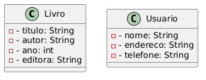
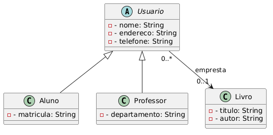
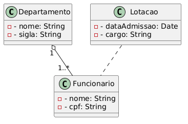
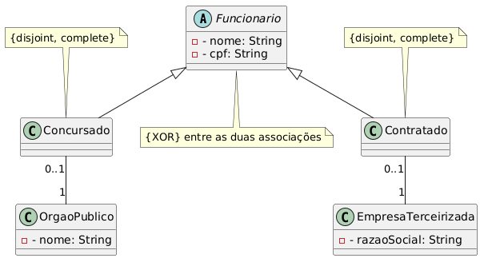
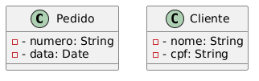
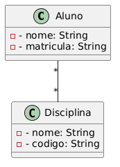
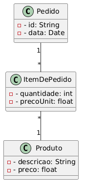
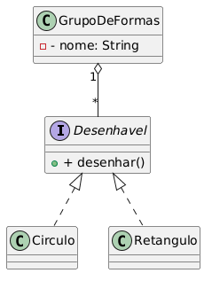

# Atividades de fixação - Diagrama de classes
## Worked Examples

### Worked Example 1 – Identificação de Classes e Atributos (Básico)

**Contexto:**  
Uma pequena biblioteca deseja controlar seu acervo de livros. Para cada livro, é necessário armazenar o título, o autor, o ano de publicação e a editora. Além disso, a biblioteca precisa registrar os usuários que podem fazer empréstimos: nome, endereço e telefone.

**Tarefa:**  
Crie um diagrama de classes conceitual que represente as classes **Livro** e **Usuario**, com seus respectivos atributos.

**Solução:**

**Explicação:**  
- As classes são nomeadas no singular, com substantivos do domínio.  
- Atributos são listados no segundo compartimento, com nomes em camelCase e tipos simples (String, int).  
- Usamos visibilidade `-` (privado) por padrão, mesmo em nível conceitual.

---

### Worked Example 2 – Associações e Multiplicidades

**Contexto:**  
No sistema da biblioteca, um usuário pode pegar emprestado vários livros, mas um livro só pode estar emprestado para um usuário por vez (considere que o livro pode estar disponível ou emprestado). Modele a associação entre **Usuario** e **Livro** com as multiplicidades adequadas.

**Tarefa:**  
Adicione a associação ao diagrama anterior, incluindo o nome da associação (opcional) e as multiplicidades.

**Solução:**

[Diagrama de associação entre Livro e Usuario com multiplicidades](img/we2-associacao-emprestimo.png)

**Explicação:**  
- A seta de navegabilidade (opcional) indica que o livro "conhece" seu usuário.  
- Multiplicidade `0..1` do lado do usuário significa que um livro pode estar associado a no máximo um usuário (ou nenhum, se disponível).  
- Multiplicidade `0..*` do lado do livro significa que um usuário pode ter zero ou vários livros emprestados.  
- O nome da associação "empresta" pode ser colocado, mas não é obrigatório se o contexto for claro.

---

### Worked Example 3 – Generalização/Especialização

**Contexto:**  
A biblioteca possui dois tipos de usuários: **Aluno** e **Professor**. Ambos herdam os atributos de **Usuario** (nome, endereço, telefone). Além disso, alunos têm **matrícula** e professores têm **departamento**. Alunos podem pegar até 3 livros, professores até 5.

**Tarefa:**  
Modele a hierarquia de herança e inclua as multiplicidades nos empréstimos considerando essas regras.

**Solução:**

**Explicação:**  
- A classe **Usuario** é abstrata (nome em itálico) – não pode ser instanciada.  
- **Aluno** e **Professor** são subclasses concretas.  
- A associação de empréstimo é feita com a superclasse, pois ambos os tipos podem pegar livros.  
- As multiplicidades (0..* de Usuario para Livro) permanecem, mas as regras de limite (3 ou 5) seriam implementadas em código ou restrições futuras.

---

### Worked Example 4 – Agregação/Composição e Classe de Associação

**Contexto:**  
Em uma empresa, um **Departamento** é composto por vários **Funcionários**. Um funcionário só pode pertencer a um departamento por vez. Quando um departamento é fechado, seus funcionários são realocados (não são demitidos automaticamente). Além disso, a associação entre Funcionário e Departamento possui atributos como **data de admissão** e **cargo**.

**Tarefa:**  
Modele usando composição? Ou agregação? E como representar os atributos da associação?

**Solução:**

**Explicação:**  
- A relação é de agregação (losango vazio) porque as partes (funcionários) podem existir sem o todo (departamento).  
- A classe de associação **Lotacao** armazena os atributos específicos do vínculo.  
- Multiplicidades: 1 departamento pode ter 1..* funcionários; 1 funcionário pode estar em 1 departamento (no máximo).  
- A linha tracejada liga a classe de associação à associação.

---

### Worked Example 5 – Restrições e XOR

**Contexto:**  
Em um sistema de recursos humanos, um **Funcionario** pode ser **Concursado** ou **Contratado**, mas não ambos. Além disso, um funcionário concursado está vinculado a um **OrgaoPublico**, enquanto um contratado está vinculado a uma **EmpresaTerceirizada**.

**Tarefa:**  
Modele a generalização com restrição de disjunção e uma restrição XOR para os vínculos.

**Solução:**

**Explicação:**  
- A generalização é `{disjoint, complete}`: um funcionário é de um tipo ou de outro, e todos os funcionários são especializados.  
- A restrição `{XOR}` aplicada às duas associações garante que um funcionário esteja vinculado a **um** dos dois (órgão ou empresa), mas não a ambos.  
- As multiplicidades `0..1` indicam que o vínculo é opcional (pode haver funcionário sem vínculo? Depende do contexto, mas aqui consideramos que todo funcionário tem um vínculo).

---

## Faded Worked Examples

### Faded Worked Example 1 – Multiplicidades e Nomes de Associação (Iniciante)

**Contexto (parcial):**  
Um sistema de vendas possui as classes **Pedido** e **Cliente**. Sabe-se que um cliente pode fazer vários pedidos, e um pedido pertence a um único cliente.

**Diagrama parcial:**

**Tarefas:**  
1. Desenhe a associação entre as classes.  
2. Coloque as multiplicidades corretas nos dois lados.  
3. Dê um nome para a associação (opcional, mas use um verbo).  
4. Indique a navegabilidade se achar relevante.

**Dicas:**  
- Lembre-se: "um cliente *tem* vários pedidos" → qual a multiplicidade do lado do cliente?  
- "Um pedido *pertence a* um cliente" → qual a multiplicidade do lado do pedido?

---

### Faded Worked Example 2 – Herança (Intermediário)

**Contexto:**  
Uma universidade precisa cadastrar **Pessoas** que podem ser **Alunos** ou **Professores**. Atributos comuns: nome, email, telefone. Alunos têm **matrícula** e **curso**. Professores têm **departamento** e **salário**.

**Diagrama parcial:**

**Tarefas:**  
1. Desenhe as subclasses **Aluno** e **Professor** com seus atributos específicos.  
2. Indique se a classe Pessoa é abstrata ou concreta. Justifique.  
3. Adicione uma associação: "Um professor orienta vários alunos, e um aluno tem um orientador (que é um professor)". Modele essa associação com multiplicidades.

---

### Faded Worked Example 3 – Classe de Associação (Intermediário)

**Contexto:**  
Em um sistema de matrículas, um **Aluno** pode se matricular em várias **Disciplinas**, e uma disciplina pode ter vários alunos. A data da matrícula e a nota final são informações que dependem da associação.

**Diagrama parcial:**

**Tarefas:**  
1. Transforme a associação muitos-para-muitos em uma classe de associação chamada **Matricula**.  
2. Adicione os atributos `dataMatricula: Date` e `nota: float` (opcional) nessa nova classe.  
3. Represente corretamente a ligação (linha tracejada) entre a classe de associação e a associação.

---

### Faded Worked Example 4 – Agregação vs. Composição (Avançado)

**Contexto:**  
Um sistema de pedidos online: um **Pedido** contém **ItensDePedido**. Cada item refere-se a um **Produto**. Se o pedido for cancelado, os itens também devem ser removidos. No entanto, os produtos permanecem no catálogo.

**Diagrama parcial:**

**Tarefas:**  
1. Que tipo de relacionamento (agregação ou composição) deve ser usado entre Pedido e ItemDePedido? Por quê?  
2. Desenhe o losango correspondente.  
3. Modele a associação entre ItemDePedido e Produto (um item refere-se a um produto, um produto pode estar em vários itens). Coloque as multiplicidades.  
4. Complete o diagrama com os losangos e multiplicidades.

---

### Faded Worked Example 5 – Restrições e Interfaces (Avançado)

**Contexto:**  
Um sistema gráfico precisa desenhar formas (**Circulo**, **Retangulo**) que implementam uma interface **Desenhavel** com o método `desenhar()`. Além disso, um **GrupoDeFormas** pode conter várias formas (agregação). Há uma restrição: um círculo não pode pertencer a mais de um grupo ao mesmo tempo.

**Diagrama parcial:**

**Tarefas:**  
1. Complete o relacionamento de realização entre as classes concretas e a interface.  
2. Adicione a agregação entre **GrupoDeFormas** e a interface **Desenhavel** (o grupo contém formas).  
3. Aplique uma restrição para garantir que um círculo não esteja em mais de um grupo ao mesmo tempo. Como você faria isso? (Dica: use multiplicidade e/ou restrição.)  
4. Coloque as multiplicidades corretas: um grupo pode conter 0..* formas; uma forma pode estar em 0..1 grupo.
